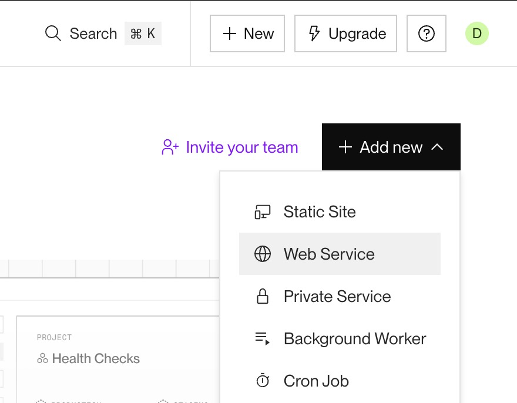
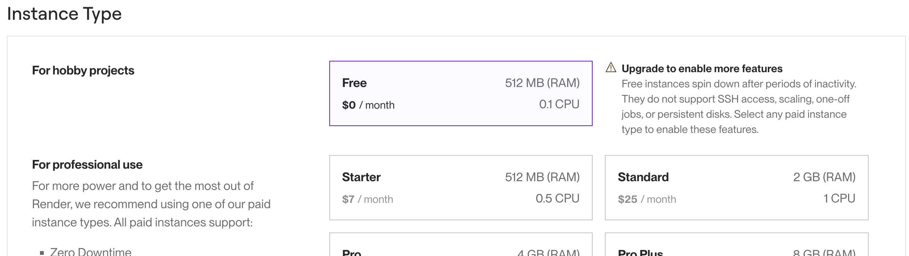

# Deployment med Render

Da I ikke kan aflevere jeres eksamensprojekt med en lokal udviklingsserver (localhost:4000), skal I deploye jeres backend til en fjernserver, inden I afleverer.

Det er en god idé at gøre det tidligt i forløbet, så I kan teste jeres frontend (Next.js) mod den deployede backend en gang i mellem.

I har kun brug for én fjernserver pr. gruppe, så vælg vedkommende, der ejer eksamensprojektets repository til at gøre det.

Vi bruger render.com, da det er gratis.

## Fjernserver på Render

Følg disse trin for at deploye din backend (via GitHub):

1. **Opret en konto på Render:**
   - Gå til [Render](https://render.com) og log ind med din GitHub-konto.

2. **Opret en ny Web Service:**
   - Klik på "New" eller "Add new" og vælg "Web Service".
     
   - Vælg dit repository fra GitHub.
   - Konfigurer buildindstillingerne:
     - **Build Command:** `npm install`
     - **Start Command:** `npm start`

3. **Vælg Free og Region:**
   - I deployment-indstillingerne skal du vælge **Free**.
     
   - Sæt din "Region" til **Frankfurt** for optimal performance.

4. **Deployment færdiggøres:**
   - Klik på "Deploy Web Service".
   - Når den har deployet, vil Render give din server et unikt domænenavn, f.eks. `your-app-name.onrender.com`.

5. **Test din server:**
   - Besøg din applikation via URL'en (fx `https://your-app-name.onrender.com`).
   - Tilføj endpointet `/health` til URL'en for at sikre, at backend'en kører korrekt (fx `https://your-app-name.onrender.com/health`).
   - Test også et rigtigt data-endpoint, fx `https://your-app-name.onrender.com/events`.

## Brug fjernserveren i Next.js

Når backend'en er deployet, skal jeres Next.js-projekt bruge Render-URL'en i stedet for `localhost:4000`.

Opret fx en `.env.local` i jeres Next.js-projekt:

```env
NEXT_PUBLIC_API_URL=https://your-app-name.onrender.com
```

Brug derefter miljøvariablen, når I fetcher data:

```js
const response = await fetch(`${process.env.NEXT_PUBLIC_API_URL}/events`);
const events = await response.json();
```

Til data der kan ændre sig, fx kommentarer og reservationer, skal I være opmærksomme på Next.js' caching.

I Next.js-projekter med Cache Components (`cacheComponents: true`) er tommelfingerreglen:

- Brug `"use cache"` til data, der gerne må genbruges, fx en event-oversigt.
- Brug ikke `"use cache"` til data, der skal være frisk, fx kommentarer og reservationer.

Et simpelt eksempel til event-kommentarer kan derfor se sådan ud:

```js
async function getEventComments(eventId) {
  const response = await fetch(
    `${process.env.NEXT_PUBLIC_API_URL}/comments?eventId=${eventId}`,
  );

  return response.json();
}
```

Hvis komponenten fetcher frisk data på serveren, kan den med fordel vises via `Suspense`, så siden stadig kan have en loading-state:

```jsx
import { Suspense } from "react";

async function EventComments({ eventId }) {
  const comments = await getEventComments(eventId);

  return (
    <ul>
      {comments.map((comment) => (
        <li key={comment.id}>{comment.content}</li>
      ))}
    </ul>
  );
}

export function CommentsSection({ eventId }) {
  return (
    <Suspense fallback={<p>Loading comments...</p>}>
      <EventComments eventId={eventId} />
    </Suspense>
  );
}
```

Event-data, som ikke ændrer sig lige så ofte, kan derimod være et godt sted at bruge `"use cache"`:

```js
import { cacheLife } from "next/cache";

export async function getEvents() {
  "use cache";
  cacheLife("hours");

  const response = await fetch(`${process.env.NEXT_PUBLIC_API_URL}/events`);
  return response.json();
}
```

### Billeder fra API'et

Billedstier i API'et er relative til backend-serveren:

```json
{
  "url": "/file-bucket/event-hero1.jpg"
}
```

I frontenden skal I derfor sætte API'ets base URL foran billedstien:

```js
const imageUrl = `${process.env.NEXT_PUBLIC_API_URL}${event.heroAsset.url}`;
```

Hvis I bruger `next/image`, skal jeres Render-domæne også tillades i `next.config.js`:

```js
const nextConfig = {
  images: {
    remotePatterns: [
      {
        protocol: "https",
        hostname: "your-app-name.onrender.com",
      },
    ],
  },
};

export default nextConfig;
```

## Data på Render

API'et bruger `db.json` som en simpel mock-database. Det betyder, at `POST /comments`, `POST /reservations`, `POST /contact_messages` osv. godt kan ændre data, mens serveren kører.

Det er dog ikke en rigtig database. På en gratis Render-service vil data blive nulstillet ved redeploy, restart eller lignende.

### Bemærk venligst

Render's gratis-version har en inaktivitetstid (ca. 15 minutter) før applikationen går i dvale for at spare ressourcer.

Hvis din applikation går i dvale, starter den op igen, men der kan opstå en kort forsinkelse (op til 50 sekunder) ved den første anmodning. Dette kan forstyrre Next.js ved serverside-fetching, hvilket er OK, da det er en gratis service.

Det kan derfor være en god idé at implementere loading- og error-UI i jeres frontend, fx `loading.js` og `error.js`.
